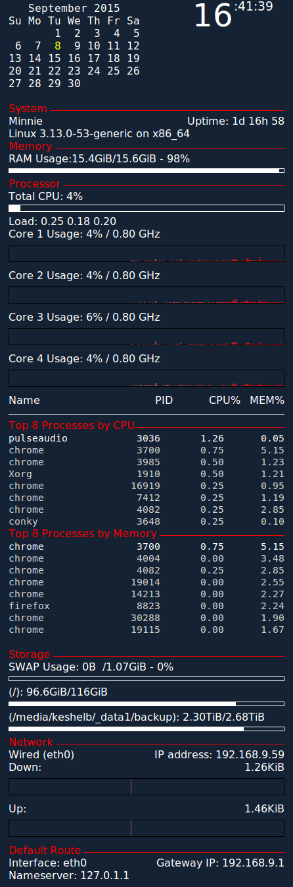

## conky

NOTE: This config is for conky version 1.9 or older. Configs changed to lua-like format in 1.10.

## Description
I have a right column with time, calendar, system info and some stats.
There is also a small Weather Underground API-driven config setup on the bottom left of my desktop for forecasts.
The weather config is driven by Ruby based on a config from https://github.com/alexbel/conky.

The configs are setup for WQHD/1440p resolution.

## Installation
Note: edit secrets.yml and add your information.  You will need to obtain an API Key from http://api.wunderground.com

